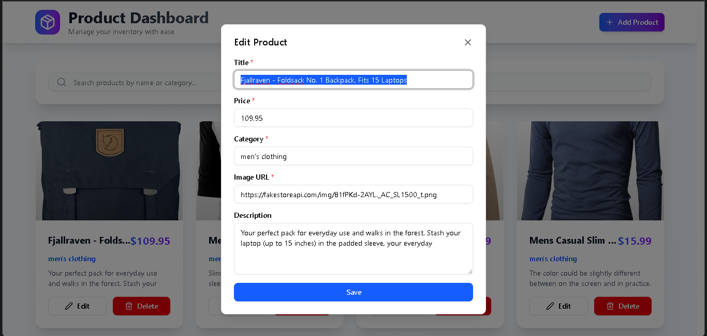
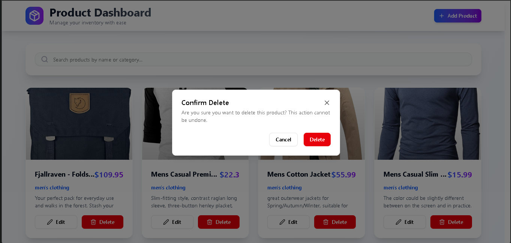
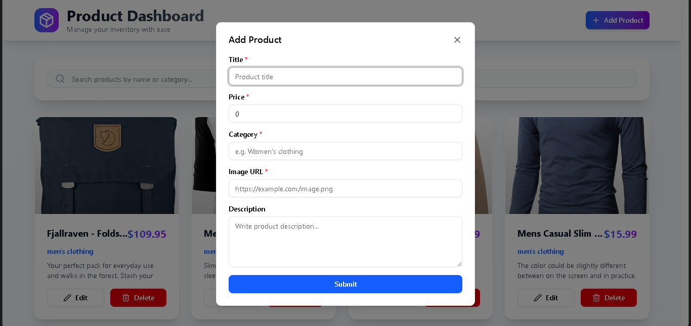

# Product Dashboard

**Product Dashboard** is a responsive web application for managing product inventories. Features include adding, editing, searching, sorting, and deleting products. Built with React, TypeScript, and Vite for fast development and performance.

## Features

- **CRUD Operations:** Create, Read, Update, Delete products
- **Search:** Search products by name or category
- **Sort:** Sort products by name, category, or price
- **Responsive UI:** Works across desktop and mobile
- **Fast Dev Experience:** Built with Vite + React + TypeScript

## Tech Stack

- **Frontend:** React (+hooks)
- **Language:** TypeScript
- **Bundler/Dev Server:** Vite

## Getting Started

### Prerequisites

- Node.js (v16+ recommended)
- npm or yarn

### Installation

# Install dependencies
npm install

### Running the App

npm run dev

### Building for Production

npm run build

## Usage

- **Add Product:** Fill the form and submit to add.
- **Edit/Delete Products:** Use edit/delete actions in the product list.
- **Search:** Enter keywords in the search bar.
- **Sort:** Click sort buttons/headers.

## Customization

- Update fields in the product model and UI components as required.
- Add authentication, pagination, or integrate with an API as needed.

